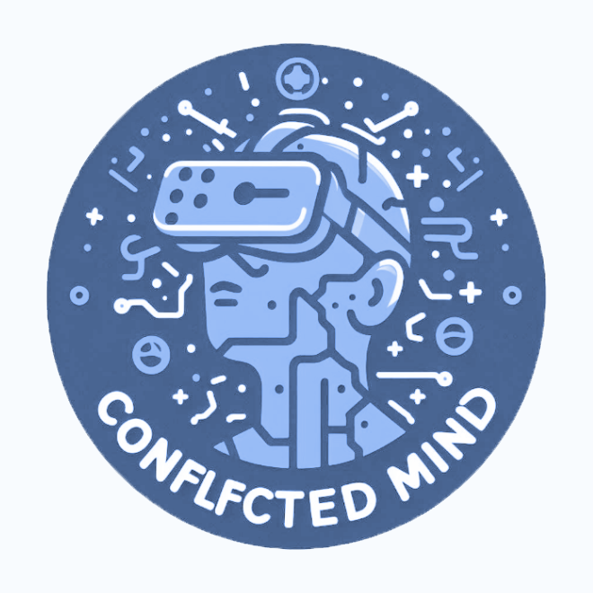
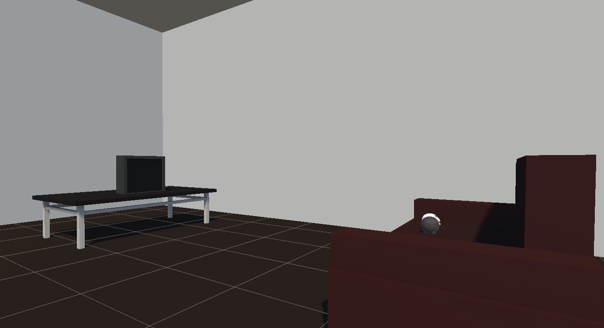
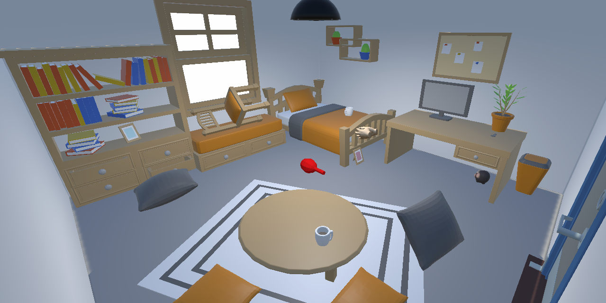
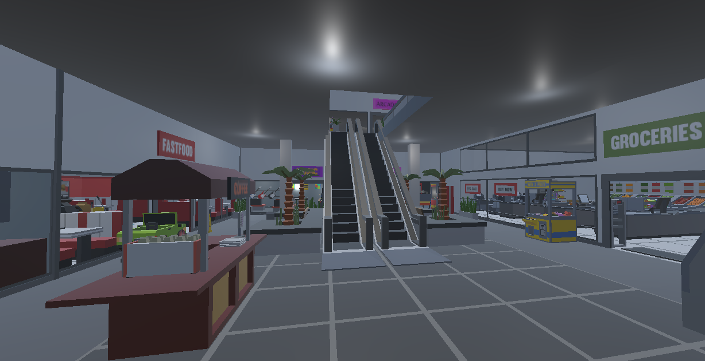
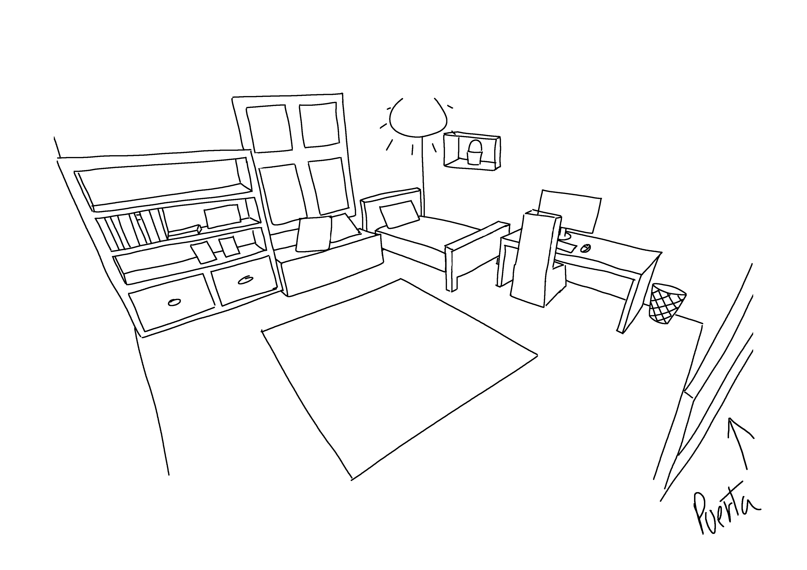

# Mente en conflicto: la experiencia VR

Repositorio del juego serio "Mente en conflicto" para la asignatura Juegos Serios del Grado de Desarrollo de Videojuegos de la Facultad de informática de la Universidad Complutense de Madrid.

Vídeo sobre el juego: https://youtu.be/6tNnlkBnO7U

Vídeo de Gameplay: https://youtu.be/sCt7C92yv-g

Laura Gómez Bodego ( <lgomez25@ucm.es> ),
Sergio Baña Marchante ( <sebana@ucm.es> ) y Pablo Sánchez Martín ( <pablos19@ucm.es> )

| Resumen                                                                                                                                                            |                          |
| ------------------------------------------------------------------------------------------------------------------------------------------------------------------ | ------------------------ |
| **Géneros**:  Simulación                                                                                                                                       | **Modo**:  1 jugador |
| **Público Objetivo**:  Oyentes de un taller sobre ansiedad. Mayores de 16 años                                                                                 | **Plataformas**:  VR |
| **Hitos**:  5/10/2023 - Presentación de la idea.  7/11/2023 - Primera revisión del GDD  23/11/2023 - Segunda revisión del GDD  19/12/2023 - Hito 4 |                          |

## Descripción

Este proyecto inmersivo transporta al jugador a través de un nivel dividido en 2 escenarios, cada uno de los cuales representa una experiencia exagerada que simula situaciones comunes desencadenantes de ansiedad. La primera escena se centra en la fonofobia, el jugador tendrá que recoger una habitación mientras escucha sonidos fuertes que desencadenarán un ataque de ansiedad. La segunda escena es un centro comercial que tendrá que recorrer, y en el que cada vez habrá más gente como desencadenante de ansiedad social.

Para conseguir desencadenar emociones similares a la ansiedad en los participantes del proyecto hemos recurrido a diferentes técnicas: 
<ul>
<li>Efectos ópticos como desenfoque de la cámara por movimiento, cambio de color del entorno, cambio visual del tamaño de los objetos.</li>
<li>Efectos sonoros: latidos del corazón y respiraciones que aumentan su velocidad e intensidad a medida que sube el nivel de ansiedad.</li>
<li>Aumento progresivo de la cantidad de npcs para aumentar la sensación de agobio al haber cada vez más gente.</li>
<li>Sonidos constantes y a volumen exagerado en la escena de la habitación, como tráfico, obras y el tic tac de un reloj.</li>
</ul>

Este juego de realidad virtual tiene como objetivo la sensibilización acerca de la ansiedad. Para esto, se va a centrar en dos fobias específicas: la fonofobia y la agorafobia, ambas relacionadas con la ansiedad social; centrandose en las consecuencias de la ansiedad que producen a las personas afectadas.

Tratamos de desarrollar una plataforma de aprendizaje única que pretende informar, educar y generar una comprensión más completa de la ansiedad social, con el objetivo de concienciar sobre la salud mental a personas ajenas a estas emociones. El juego está pensado para jugarse en talleres sobre psicología que traten estos temas.

DISCLAIMER: Este es un juego que contiene flashes, desenfoque fuerte y movimientos bruscos de cámara, además de sonidos fuertes y agobiantes. Si el sujeto tiene un problema de epilepsia o ansiedad severa no recomendamos participar en la actividad.

## Requisitos de la actividad

Para poder llevar a cabo esta actividad en talleres, serán necesarias al menos unas gafas de realidad virtual: Oculus Quest 2, un ordenador compatible con estas gafas que contenga además el juego en su versión más actualizada. Además tambien es necesario un cable de conexión entre las gafas y el ordenador o conexión por wifi AirLink.

## Logotipo y portada del juego

  

## ÍNDICE

  <ol>
    <!---1--->
    <li><a href="#1-aspectos-generales">Aspectos generales</a>
      <ul>
        <li><a href="#11-relato-breve-y-parcial-de-una-partida-típica">Relato breve y parcial de una partida típica</a></li>
      </ul>
    </li>
    <!---2--->
    <li><a href="#2-menús-y-modos-de-juego">Menús y modos de juego</a>
      <ul>
        <li><a href="#21-configuración">Configuración</a></li>
        <li><a href="#22-interfaz">Interfaz</a></li>
      </ul>
    </li>
    <!---3--->
    <li><a href="#3-jugabilidad">Jugabilidad</a>
        <ul>
            <li><a href="#31-mecánicas">Mecánicas</a>
                <ul>
                    <li><a href="#311-mecánicas-de-personaje">Mecánicas de Personaje</a></li>
                    <li><a href="#312-mecánicas-de-escenario">Mecánicas de Escenario</a>
                        <ul>
                            <li><a href="#3121-fonofobia">Fonofobia</a></li>
                            <li><a href="#3122-agorafobia">Agorafobia</a></li>
                        </ul>
                    </li>
                </ul>
            </li>
            <li><a href="#32-dinámicas">Dinámicas</a>
                <ul>
                    <li><a href="#321-fonofobia">Fonofobia</a></li>
                    <li><a href="#322-agorafobia">Agorafobia</a></li>
                </ul>
            </li>
            <li><a href="#33-estética">Estética</a></li>
            <li><a href="#34-cámara">Cámara</a></li>
            <li><a href="#35-controles">Controles</a></li>
        </ul>
    </li>
    <!---4--->
    <li><a href="#4-contenido">Contenido</a>
        <ul>
            <li><a href="#41-juego">Juego</a>
                <ul>
                    <li><a href="#411-fonofobia">Fonofobia</a></li>
                    <li><a href="#412-agorafobia">Agorafobia</a></li>
                </ul>
            </li>
        </ul>
    </li>
    <!---5--->
    <li><a href="#5-referencias">Referencias</a></li>
  </ol>

## 1. Aspectos generales

### Vista general

  

  

  

#### 1.1. Relato breve y parcial de una partida típica  

El jugador comienza la partida en una escena de menú que tiene una puerta bloqueada, en esta un narrador le introduce al juego y le explica lo que está a punto de experimentar. Una vez el narrador acabe de hablar, se desbloquea la puerta. Al abrira pasa a una habitación desordenada que debe ordenar, colocando cada objeto en su sitio. Mientras tanto, escuchará distintos sonidos que vienen de dentro y fuera de la habitación, a medida que pasa el tiempo, estos sonidos se iran volviendo más intensos y la ansiedad irá subiendo, hasta provocar un ataque de ansiedad. Una vez haya recogido la habitación, el jugador abre la puerta con la llave y pasa a la escena del centro comercial. En esta escena tendrá que ir de tienda en tienda recogiendo los objetos marcados, evitando chocarse con los npc para no desatar un ataque de ansiedad. Una vez recogidos los objetos, se le muestra al jugador un camino hacia un trigger que traslada al jugador a una escena en la que un narrador le explica lo que acaba de suceder y los efectos de la ansiedad social.

## 2. Menús y modos de juego

El juego no tiene ningún menú de configuración y no habrá menú de pausa.

La ausencia de un menú de pausa en el juego, desde una perspectiva de diseño, refuerza el objetivo principal (sensibilizar a los jugadores sobre la ansiedad en situaciones fóbicas)

De esta forma intentamos reflejar la realidad de la ansiedad, donde las personas a menudo no tienen la capacidad de detener o pausar situaciones que les causan malestar. Al no permitir que los jugadores detengan la experiencia a mitad del camino, se logra una inmersión más profunda, lo que puede generar una mayor comprensión de lo que sienten las personas que experimentan ansiedad en la vida real.

### 2.1. Configuración

 En todas las escenas habrá un "Botón del pánico", que finalizará el juego de forma inmediata.

### 2.2. Interfaz  

La interfaz se representa mediante objetos físicos en cada nivel. Esto es porque una imagen fija en realidad virtual causaría malestar físico al jugador, al ser algo antinatural.

- 
Tiempo de partida: En cada escena habrá un reloj físico a la vista, con el que el jugador no podrá interactuar, que lleve la cuenta del tiempo que lleva el jugador en la partida.
- 
Objetivo del nivel: se representará como un cartel en algún punto que sea altamente visible de la sala. Los objetos que tengas que recoger tendrán un outline para hacerle entender al jugador los objetos con los que tiene que interactuar.
- 
Centro comercial: Para representar, en el centro comercial, el objetivo, el sitio hacia donde se tiene que dirigir el jugador, se dibujará en el suelo un camino de puntos que indicará al jugador como llegar al objetivo

## 3. Jugabilidad

### 3.1. Mecánicas

#### 3.1.1. Mecánicas de personaje

- El jugador podrá moverse por el escenario en todas las direcciones.
- El jugador podrá coger objetos y dejarlos en su mano.
- El jugador podrá interactuar con puertas

#### 3.1.2. Mecánicas de escenario

- El nivel contendrá objetos con los que se podrá interactuar, se podrán recoger y soltar.
- Todos los niveles contienen algún botón del pánico, el cual se puede pulsar para acabar con la partida.

##### 3.1.2.1. Fonofobia

A lo largo de esta parte del juego, se irán reproduciendo aleatoriamente varios sonidos. Estos sonidos están divididos según su intensidad / volúmen y el efecto que pueden causar en el jugador. Al principio, se reproducirá los que menos afecten, para ir aumentando progresivamente la intensidad, es decir, los sonidos sonarán de forma aleatoria pero incremental. Además, todos los sonidos sonarán más fuerte de lo normal para surtir más efecto. Los sonidos se dividen en:

- Poco intensos:
  - Gente hablando en la calle
  - Tráfico de fondo
  - Camión de la basura
- Intensos:
  - Objetos que se caen
  - Ambulancias en la calle
  - Alarma de un coche en la calle
  - Portazos en el piso de al lado
  - Golpes a la pared
- Muy intensos:
  - Timbre de casa
  - Obras en el piso de al lado
  - Gritos de vecinos
  - Tele que se enciende de golpe

##### 3.1.2.2. Agorafobia

- Conforme avance el nivel, los NPCs que hay a lo largo del escenario, comenzarán a mirar al jugador cada vez más y aparecerán mas npcs
- Se reproducirá sonidos de gente riendo, que se irán haciendo más fuertes según avance la parte del nivel.

### 3.2. Dinámicas

Dependiendo del escenario, se distinguen varias dinámicas:

#### 3.2.1. Fonofobia

El objetivo es recoger un cuarto desorganizado mientras suenan diferentes sonidos que no puede controlar, y que suenan exageradamente altos.

En cuanto al objetivo educativo, se pretende que el jugador se sienta abrumado por los sonidos, y que se sienta incapaz de hacer nada para pararlos, de tal forma que se cumpla el objetivo de concienciación propuesto.

#### 3.2.2. Agorafobia

El objetivo de este escenario es ir a un centro comercial a comprar algo y volver a la salida de este. En el camino el jugador se irá encontrando cada vez más gente y le dará la sensación de pasar menos inadvertido.

En cuanto al objetivo educativo, se pretende que el jugador se sienta abrumado por la cantidad de gente que hay a su alrededor, que se sienta observado, el centro de atención y que se sienta incapaz de hacer nada para pararlos, de tal forma que se cumpla el objetivo de concienciación propuesto. 

### 3.3. Estética

Los modelos 3D serán low poly.

Al jugador se le transmitirá una sensación de agobio y ansiedad mediante técnicas como el uso de sonidos y el movimiento de la cámara:

- A medida que el jugador va avanzando, empezará a escuchar su corazón, el cual está latiendo muy deprisa.
- Sonará su respiración entrecortada a medida que la ansiedad del jugador va avanzando.
- La cámara temblará para dar un efecto de mareo o náuseas a medida que la ansiedad del jugador va avanzando.

### 3.4. Cámara

La cámara será en primera persona, siendo controlada con los cascos de Realidad Virtual dependiendo de dónde mira el jugador en la vida real.

### 3.5. Controles

- El juego se controlará mediante las Meta Quest 2.
- La cámara se controlará mediante el movimiento de la cabeza del jugador
- El jugador se moverá mediante el joystick del mando de la mano izquierda.
- - La rotación del jugador se podrá manejar también mediante el joystick del mando de la mano derecha.
- Para interactuar con objetos (agarrar, pulsar cosas, etcétera) se usarán los gatillos inferiores de los mandos

El objetivo educativo de este juego en realidad virtual es hacer que el jugador se implique mucho más con las situaciones, y que sienta de forma más real las sensaciones que intentamos transmitir, de tal forma que se cumpla el objetivo de concienciación propuesto.

## 4. Contenido

### 4.1 Juego

El juego se divide en cuatro partes, dos de inicio y final donde hay un audio que explican cosas relacionadas con el juego, y las otras dos que ponen el enfoque en una de las dos fobias que vamos a abordar.

#### 4.1.1 Presentación
El juego empieza en una sala de espera en la que sale un audio de una television que explica de qué trata el juego y cuál es su objetivo. Al acabar el audio se desbloquea una puerta que te lleva a la siguiente escena.

#### 4.1.2 Fonofobia

En esta escena se presenta al jugador en una sala completamente desorganizada.

El objetivo de este nivel es recoger la habitación. A lo largo del nivel irán sonando ruidos de fondo (ambulancias, portazos, gritos, etc.), cada vez más altos y de intensidades más altas dependiendo de la intensidad del jugador, la cual va aumentando a lo largo del tiempo. Cuando se llega a un nivel alto de ansiedad al jugador le dará un ataque, representado por el sonido de latidos de tu corazón cada vez más altos y rápidos y la cámara cada vez más borrosa. Cuando eso suceda, el jugador tendrá que mantenerse quieto y en silencio total hasta que se le pase. Se pretende con esto simular un ataque de pánico, y generar gran  ansiedad en el jugador. Esta parte del nivel terminará cuando acabe de recoger la habitación y salgas por la puerta, dando lugar a la segunda parte.

  

La habitación, una habitación de un piso de estudiante, estará llena de objetos que el jugador tendrá que recoger y colocar en su sitio. La imagen de arriba muestra un esquema de la habitación, con los objetos que habrá que recoger y colocar en su sitio. Entre estos objetos se encuentran:
- Almohadas
- Libros
- Cuadros
- Tazas
- Componentes de ordenador (teclado...)
- Sillas
- Macetas

En la habitación habrá también una llave, que el jugador tendrá que coger para poder abrir la puerta de la habitación y salir. No obstante, el jugador no podrá salir de la habitación hasta que no haya recogido todos los objetos.

#### 4.1.3 Agorafobia

El jugador sale de casa a un centro comercial. A medida que avanza el camino habrá cada vez más personas y más ruido, haciendo que el agobio se incremente en el tiempo. El jugador tendrá que ir a varias tiendas recogiendo objetos y volver a la entrada del centro comercial, viendo el centro cada vez más lleno. Esta escena acaba cuando el jugador llega a la entrada del centro comercial, marcada con un camino de puntos cuando se hayan recogido todos los objetos.

  

La imagen muestra un esquema de como será el centro comercial.

### 5. Referencias

- Celeste: [Steam - Celeste](https://store.steampowered.com/app/504230/Celeste/)
- Please Knock on My Door: [Steam - Please Knock on My Door](https://store.steampowered.com/app/613450/Please_Knock_on_My_Door/)
- SoundFields: [MDPI - SoundFields](https://www.mdpi.com/2076-3417/13/11/6783)
- Logotipo del juego hecho con el chat de IA de bing, con gpt4
- Modelo de la habitación: https://www.cgtrader.com/free-3d-models/interior/bedroom/another-bedroom
- Modelo del centro comercial: https://assetstore.unity.com/packages/3d/props/interior/simple-shop-interiors-cartoon-assets-38029
- Modelo de los personajes: https://assetstore.unity.com/packages/3d/environments/urban/polygon-city-low-poly-3d-art-by-synty-95214
- Tutoriales en VR: https://www.youtube.com/@ValemTutorials
- Animaciones: https://www.mixamo.com/#/
- Sonidos: https://freesound.org/ y https://mixkit.co/
- Reloj de la habitación: https://assetstore.unity.com/packages/3d/props/interior/clock-free-44164
- Quick Outline: https://assetstore.unity.com/packages/tools/particles-effects/quick-outline-115488
- Toolkit utilizado para trabajar con VR: https://docs.unity3d.com/Packages/com.unity.xr.interaction.toolkit@2.5/manual/index.html

### 6. Vídeo

https://drive.google.com/file/d/1kuPaO0daKjAS-ms5Gso2HsNyM9N5jPYr/view?usp=drive_link
