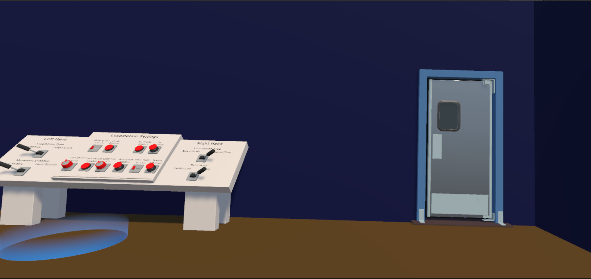

# Mente en conflicto: la experiencia VR

Laura Gómez Bodego ( <lgomez25@ucm.es> ),
Sergio Baña Marchante ( <sebana@ucm.es> ) y Pablo Sánchez Martín ( <pablos19@ucm.es> )

| Resumen                                                                                        |                          |
| ---------------------------------------------------------------------------------------------- | ------------------------ |
| **Géneros**:  Simulación                                                                   | **Modo**:  1 jugador |
| **Público Objetivo**:  Oyentes de un taller sobre ansiedad. Mayores de 16 años             | **Plataformas**:  VR |
| **Hitos**:  5/10/2023 - Presentación de la idea.  7/11/2023 - Primera revisión del GDD | **Cantidades:**          |

## Descripción

Juego de realidad virtual que aborda la sensibilización acerca de la ansiedad. Para alcanzar este objetivo de forma concisa,  se relaciona con fobias específicas y se centrará en la ansiedad que estas producen. Este proyecto inmersivo transporta al jugador a través de un nivel dividido en 2 escenarios, cada uno de los cuales representa una experiencia exagerada que simula situaciones comunes desencadenantes de ansiedad, tales como el miedo a los sonidos fuertes y ansiedad social.

Tratamos de desarrollar una plataforma de aprendizaje única que pretende informar, educar y generar una comprensión más completa de la ansiedad, lo que lo convierte en una herramienta valiosa tanto para el entretenimiento como para la concienciación sobre la salud mental.
El juego está pensado para jugarse en talleres sobre psicología que traten estos temas.

## Logotipo y portada del juego

  

## ÍNDICE

  <ol>
    <!---1--->
    <li><a href="#1-aspectos-generales">Aspectos generales</a>
      <ul>
        <li><a href="#11-relato-breve-y-parcial-de-una-partida-típica">Relato breve y parcial de una partida típica</a></li>
      </ul>
    </li>
    <!---2--->
    <li><a href="#2-menús-y-modos-de-juego">Menús y modos de juego</a>
      <ul>
        <li><a href="#21-configuración">Configuración</a></li>
        <li><a href="#22-interfaz">Interfaz</a></li>
      </ul>
    </li>
    <!---3--->
    <li><a href="#3-jugabilidad">Jugabilidad</a>
        <ul>
            <li><a href="#31-mecánicas">Mecánicas</a>
                <ul>
                    <li><a href="#311-mecánicas-de-personaje">Mecánicas de Personaje</a></li>
                    <li><a href="#312-mecánicas-de-escenario">Mecánicas de Escenario</a>
                        <ul>
                            <li><a href="#3121-fonofobia">Fonofobia</a></li>
                            <li><a href="#3122-agorafobia">Agorafobia</a></li>
                        </ul>
                    </li>
                </ul>
            </li>
            <li><a href="#32-dinámicas">Dinámicas</a>
                <ul>
                    <li><a href="#321-fonofobia">Fonofobia</a></li>
                    <li><a href="#322-agorafobia">Agorafobia</a></li>
                </ul>
            </li>
            <li><a href="#33-estética">Estética</a></li>
            <li><a href="#34-cámara">Cámara</a></li>
            <li><a href="#35-controles">Controles</a></li>
        </ul>
    </li>
    <!---4--->
    <li><a href="#4-contenido">Contenido</a>
        <ul>
            <li><a href="#41-juego">Juego</a>
                <ul>
                    <li><a href="#411-fonofobia">Fonofobia</a></li>
                    <li><a href="#412-agorafobia">Agorafobia</a></li>
                </ul>
            </li>
        </ul>
    </li>
    <!---5--->
    <li><a href="#5-referencias">Referencias</a></li>
  </ol>

## 1. Aspectos generales

### Vista general

  

  

#### 1.1. Relato breve y parcial de una partida típica  

## 2. Menús y modos de juego

El juego consta de un menú inicial de configuración y uno final. No habrá menú de pausa.

La ausencia de un menú de pausa en el juego, desde una perspectiva de diseño deliberada, refuerza el objetivo principal
(sensibilizar a los jugadores sobre la ansiedad en situaciones fóbicas)

Este enfoque refleja de manera efectiva la realidad de la ansiedad, donde las personas a menudo no tienen la capacidad de detener o pausar situaciones que les causan malestar. Al no permitir que los jugadores detengan la experiencia a mitad del camino, se logra una inmersión más profunda, lo que puede generar una mayor comprensión de lo que sienten las personas que experimentan ansiedad en la vida real.

### 2.1. Configuración

- Menú principal: Cuenta con los siguientes botones:
  - Play: Inicia el juego
  - Options: lleva a una ventana de configuración para ajustar la velocidad del jugador, el sonido del juego, etc
  - Exit: te saca del juego

- Menú de final de nivel: Este menú aparecerá cuando se acabe la partida. En él se mostrará:
  - Botón de menú: te dirige al menú principal.
  - Una breve descripción de las fobias

### 2.2. Interfaz  

En los menús, la interfaz se representará como un panel estático, fijo en el escenario con distintos botones con los que se pueda interactuar para modificar el volumen, velocidad del jugador, etc.
La interfaz se representa mediante objetos físicos en cada nivel. Esto es porque una imagen fija en realidad virtual causaría malestar físico al jugador, al ser algo antinatural.

- Tiempo de partida: En cada escena habrá un reloj físico a la vista, con el que el jugador no podrá interactuar, que lleve la cuenta del tiempo que lleva el jugador en la partida.
- Objetivo del nivel: se representará como un cartel en algún punto que sea altamente visible de la sala.

## 3. Jugabilidad

### 3.1. Mecánicas

#### 3.1.1. Mecánicas de personaje

- El jugador podrá moverse por el escenario en todas las direcciones.
- El jugador podrá coger objetos y dejarlos en su mano.

#### 3.1.2. Mecánicas de escenario

- El nivel contendrá objetos con los que se podrá interactuar, se podrán recoger y se podrán soltar.

##### 3.1.2.1. Fonofobia

A lo largo de esta parte del juego, se irán reproduciendo aleatoriamente varios sonidos. Estos sonidos están divididos según su intensidad / volúmen y el efecto que pueden causar en el jugador. Al principio, se reproducirá los que menos afecten, para ir aumentando progresivamente la intensidad. Además, todos los sonidos sonarán más fuerte de lo normal para surtir más efecto. Los sonidos se dividen en:

- Poco intensos:
  - Gente hablando en la calle
  - Tráfico de fondo
  - Camión de la basura
- Intensos:
  - Objetos que se caen
  - Ambulancias en la calle
  - Alarma de un coche en la calle
  - Portazos en el piso de al lado
  - Golpes a la pared
- Muy intensos:
  - Timbre de casa
  - Obras en el piso de al lado
  - Gritos de vecinos
  - Tele que se enciende de golpe

##### 3.1.2.2. Agorafobia

- Conforme avance el nivel, los NPCs que hay a lo largo del escenario, comenzarán a mirar al jugador cada vez más
- Se reproducirá sonidos de gente riendo, que se irán haciendo más fuertes según avance la parte del nivel.

### 3.2. Dinámicas

Dependiendo del escenario, se distinguen varias dinámicas:

#### 3.2.1. Fonofobia

El objetivo es recoger un cuarto desorganizado mientras suenan diferentes sonidos que no puede controlar, y que suenan exageradamente altos.

#### 3.2.2. Agorafobia

El objetivo de este escenario es ir a un centro comercial a comprar algo y volver a la salida de este. En el camino el jugador se irá encontrando cada vez más gente y le dará la sensación de pasar menos inadvertido.

### 3.3. Estética

Los modelos 3D serán low poly.

Al jugador se le transmitirá una sensación de agobio y ansiedad mediante técnicas como el uso de sonidos y el movimiento de la cámara:

- A medida que el jugador va avanzando, empezará a escuchar su corazón, el cual está latiendo muy deprisa.
- Sonará su respiración entrecortada a medida que el jugador va avanzando.
- La cámara temblará para dar un efecto de mareo o náuseas a medida que el jugador va avanzando.

### 3.4. Cámara

La cámara será en primera persona, siendo controlada con los cascos de Realidad Virtual dependiendo de dónde mira el jugador en la vida real.

### 3.5. Controles

- El juego se controlará mediante las Meta Quest 2.
- La cámara se controlará mediante el movimiento de la cabeza del jugador
- El jugador se moverá mediante el joystick del mando de la mano izquierda.
- Para interactuar con objetos (agarrar, pulsar cosas, etcétera) se usarán los gatillos inferiores de los mandos

El objetivo educativo de este juego en realidad virtual es hacer que el jugador se implique mucho más con las situaciones, y que sienta de forma más real las sensaciones que intentamos transmitir, de tal forma que se cumpla el objetivo de concienciación propuesto.

## 4. Contenido

### 4.1 Juego

El juego se divide en dos partes, ambas poniendo el enfoque en una de las dos fobias que vamos a abordar.

#### 4.1.1 Fonofobia

En esta escena se presenta al jugador en una sala completamente desorganizada.

El objetivo de este nivel es recoger la habitación. A lo largo del nivel irán sonando ruidos de fondo (ambulancias, portazos, gritos, etc.), cada vez más altos. Cuanto más ruido se genera, más alto suenan las voces. Al final de esta parte, la cámara comienza a temblar, la visión se pone borrosa y comienza a oírse el timbre y la voz de la vecina constantemente a alto volumen. El jugador tendrá que mantenerse quieto y en silencio total hasta que pase el ruido,  además no se permitirá que el jugador interaccione con nada hasta que finalice esta situación unos segundos después. Se pretende con esto simular un ataque de pánico, y generar gran  ansiedad en el jugador. Esta parte del nivel terminará cuando acabe de recoger la habitación, dando lugar a la segunda parte.

#### 4.1.2 Agorafobia

Se pide al jugador que salga de casa a un centro comercial. A medida que avanza el camino habrá cada vez más personas y más ruido, haciendo que el agobio se incremente en el tiempo. El jugador tendrá que coger un bus que está lleno de gente para acabar en un centro comercial medianamente lleno. El jugador tendrá que ir a una tienda y volver a la entrada del centro comercial, viendo el centro cada vez más lleno. El juego acaba cuando el jugador llega a la entrada del centro comercial.

### 5. Referencias

- Celeste: [Steam - Celeste](https://store.steampowered.com/app/504230/Celeste/)
- Please Knock on My Door: [Steam - Please Knock on My Door](https://store.steampowered.com/app/613450/Please_Knock_on_My_Door/)
- SoundFields: [MDPI - SoundFields](https://www.mdpi.com/2076-3417/13/11/6783)
